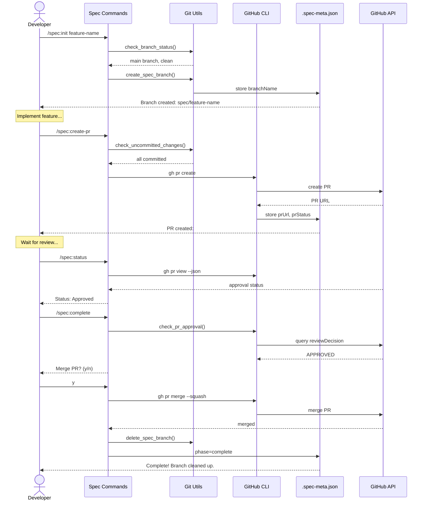

# Design Specification

## Architecture Overview
**Feature:** GitHub PR Integration
**Architecture Pattern:** Command-driven with shell script utilities

## MVP Design Constraints
- **No New Database:** Extends existing .spec-meta.json with PR fields
- **Commands:** Enhance existing commands (/spec:init, /spec:complete, /spec:status) + 1 new command (/spec:create-pr)
- **Git Operations:** Shell-based using git CLI and GitHub CLI (gh)
- **UI:** Terminal output only (no web UI)
- **No Features:** Draft PRs, PR templates, reviewer assignment, CI/CD checks, multiple PRs per spec

## System Architecture

### High-Level Architecture
```mermaid
graph TB
    subgraph "CLI Commands"
        INIT[/spec:init]
        CREATE[/spec:create-pr]
        STATUS[/spec:status]
        COMPLETE[/spec:complete]
    end

    subgraph "Shell Utilities"
        GIT_UTILS[git-utils.sh]
        GH_UTILS[gh-utils.sh]
    end

    subgraph "Spec Framework"
        META[.spec-meta.json]
        REQ[requirements.md]
        TASKS[tasks.md]
    end

    subgraph "External Services"
        GIT[Git Repository]
        GITHUB[GitHub API]
    end

    INIT -->|create branch| GIT_UTILS
    CREATE -->|push + create PR| GH_UTILS
    STATUS -->|query PR status| GH_UTILS
    COMPLETE -->|check approval| GH_UTILS

    GIT_UTILS --> META
    GH_UTILS --> META

    GIT_UTILS --> GIT
    GH_UTILS --> GITHUB
    GH_UTILS -->|via gh CLI| GITHUB
```

### Key User Flow - Happy Path (Init to Merge)


### PR Status Check Flow
```mermaid
graph TB
    START[/spec:complete called] --> CHECK_META{PR URL in<br/>.spec-meta.json?}

    CHECK_META -->|No| ERROR1[Error: No PR created.<br/>Run /spec:create-pr]
    CHECK_META -->|Yes| QUERY[Query GitHub:<br/>gh pr view --json]

    QUERY --> PARSE{Parse reviewDecision}

    PARSE -->|APPROVED| MERGE_CHECK{Mergeable?}
    PARSE -->|CHANGES_REQUESTED| ERROR2[Error: Changes requested.<br/>Address feedback.]
    PARSE -->|null/empty| ERROR3[Error: No reviews yet.<br/>Request review.]

    MERGE_CHECK -->|Yes| PROMPT[Prompt: Merge now?]
    MERGE_CHECK -->|No| ERROR4[Error: Has conflicts.<br/>Resolve conflicts first.]

    PROMPT -->|Yes| MERGE[gh pr merge --squash]
    PROMPT -->|No| SKIP[Mark complete,<br/>keep PR open]

    MERGE --> CLEANUP[Delete branches<br/>Update metadata]
    CLEANUP --> SUCCESS[Success]
    SKIP --> SUCCESS

    ERROR1 --> END
    ERROR2 --> END
    ERROR3 --> END
    ERROR4 --> END
    SUCCESS --> END[End]
```

## Components

### Component 1: Enhanced /spec:init Command
**Purpose:** Create git branch automatically during spec initialization
**Location:** `commands/spec/init.md`
**Dependencies:** git, scripts/utils/git-utils.sh, .spec-meta.json

#### Interface
```bash
/spec:init <feature-name>

# Behavior changes:
# Before: Just creates ./specs/<feature-name>/
# After: Also creates git branch spec/<feature-name>
```

#### Responsibilities
- Validate user is on main branch with clean working directory
- Create spec directory structure (existing behavior)
- Create git branch: `spec/<feature-name>`
- Checkout to new branch
- Store branch name in `.spec-meta.json`
- Handle edge cases: existing branch, dirty working directory, non-main branch

### Component 2: New /spec:create-pr Command
**Purpose:** Create GitHub PR for current spec branch
**Location:** `commands/spec/create-pr.md` (new file)
**Dependencies:** GitHub CLI (gh), git, scripts/utils/gh-utils.sh, .spec-meta.json

#### Interface
```bash
/spec:create-pr [feature-name]

# Creates PR with:
# - Base: main
# - Head: spec/<feature-name>
# - Title: "[Spec] <feature-name>"
# - Body: Links to requirements.md and design.md
```

#### Responsibilities
- Validate all changes are committed
- Validate GitHub CLI is authenticated
- Push local branch to remote
- Create PR using `gh pr create`
- Store PR URL in `.spec-meta.json` under `prUrl` field
- Update phase to "in-review"
- Handle duplicate PR attempts

### Component 3: Enhanced /spec:status Command
**Purpose:** Display PR status alongside spec progress
**Location:** `commands/spec/status.md`
**Dependencies:** GitHub CLI (gh), jq, .spec-meta.json

#### Interface
```bash
/spec:status [feature-name]

# Output includes (new):
# PR: <url>
# Review Status: <status>
# Reviewers: <list>
# Mergeable: <yes/no>
```

#### Responsibilities
- Query PR status using `gh pr view --json reviewDecision,reviews,mergeable`
- Display PR URL from metadata
- Show review status and reviewer list
- Show merge conflict status
- Suggest next action based on status

### Component 4: Enhanced /spec:complete Command
**Purpose:** Enforce PR approval before spec completion
**Location:** `commands/spec/complete.md`
**Dependencies:** GitHub CLI (gh), git, scripts/utils/gh-utils.sh, .spec-meta.json

#### Responsibilities
- Check for PR URL in metadata (fail if missing)
- Query PR approval status
- Block completion if not approved
- Prompt for merge if approved
- Execute squash merge if confirmed
- Clean up branches after successful merge
- Update metadata phase to "complete"

### Component 5: Git Utilities Module
**Purpose:** Reusable shell functions for git operations
**Location:** `scripts/utils/git-utils.sh` (new file)
**Dependencies:** git

#### Interface
```bash
# Source: source scripts/utils/git-utils.sh

check_clean_working_directory()  # Returns 0 if clean, 1 if dirty
check_current_branch()           # Echoes current branch name
is_on_main_branch()              # Returns 0 if on main, 1 otherwise
create_spec_branch(feature_name) # Creates and checks out spec/<feature-name>
delete_spec_branch(feature_name) # Deletes local and remote branch
branch_exists(branch_name)       # Returns 0 if branch exists
```

#### Responsibilities
- Validate git repository state
- Create/delete branches
- Check branch existence
- Return clear error codes for validation

### Component 6: GitHub CLI Utilities Module
**Purpose:** Reusable shell functions for GitHub PR operations
**Location:** `scripts/utils/gh-utils.sh` (new file)
**Dependencies:** GitHub CLI (gh), jq

#### Interface
```bash
# Source: source scripts/utils/gh-utils.sh

check_gh_auth()                           # Returns 0 if authenticated
create_pr(feature_name, title, body)      # Creates PR, returns URL
get_pr_review_decision(pr_url)            # Returns: APPROVED, CHANGES_REQUESTED, or empty
get_pr_status(pr_url)                     # Returns JSON with full PR status
merge_pr(pr_url, method)                  # Merges PR (method: squash|merge|rebase)
pr_exists_for_branch(branch_name)         # Returns PR URL if exists
```

#### Responsibilities
- Check GitHub CLI authentication
- Create PRs with formatted body
- Query PR approval status
- Merge PRs with specified strategy
- Check for existing PRs
- Handle GitHub API errors gracefully

## Data Models

### Extended .spec-meta.json
```json
{
  "feature": "github-prs",
  "created": "2025-10-09T00:00:00.000Z",
  "phase": "in-review",
  "lastUpdated": "2025-10-09T20:30:00.000Z",
  "branchName": "spec/github-prs",
  "prUrl": "https://github.com/user/repo/pull/123",
  "prNumber": 123,
  "prStatus": "APPROVED",
  "prCreatedAt": "2025-10-09T20:00:00.000Z",
  "prUpdatedAt": "2025-10-09T20:25:00.000Z"
}
```

**New Fields:**
- `branchName` (string): Git branch name (e.g., "spec/feature-name")
- `prUrl` (string): Full GitHub PR URL
- `prNumber` (integer): PR number
- `prStatus` (string): Review decision status (APPROVED, CHANGES_REQUESTED, null)
- `prCreatedAt` (string): ISO 8601 timestamp when PR was created
- `prUpdatedAt` (string): ISO 8601 timestamp of last PR update

**Validation Rules:**
- `branchName` must match pattern: `^spec/[a-z0-9-]+$`
- `prUrl` must be valid GitHub URL if present
- `prStatus` must be one of: APPROVED, CHANGES_REQUESTED, null
- `phase` transitions: requirements → design → implementation → in-review → complete

## API Design

### GitHub CLI API Interactions

#### Create PR
```bash
gh pr create \
  --base main \
  --head spec/<feature-name> \
  --title "[Spec] <feature-name>" \
  --body "$(cat <<EOF
## Spec Implementation: <feature-name>

This PR implements the spec for **<feature-name>**.

### Documentation
- Requirements: [requirements.md](./specs/<feature-name>/requirements.md)
- Design: [design.md](./specs/<feature-name>/design.md)
- Tasks: [tasks.md](./specs/<feature-name>/tasks.md)

### Checklist
- [x] All tasks completed
- [x] Tests passing
- [x] Documentation updated
- [x] Validation score ≥90

🤖 Generated with [Claude Code](https://claude.com/claude-code)
EOF
)"
```

**Response:** PR URL (stdout)

#### Query PR Status
```bash
gh pr view <pr-url> --json reviewDecision,reviews,mergeable,number
```

**Response:**
```json
{
  "reviewDecision": "APPROVED",
  "reviews": [
    {
      "author": {
        "login": "reviewer1"
      },
      "state": "APPROVED"
    }
  ],
  "mergeable": "MERGEABLE",
  "number": 123
}
```

#### Merge PR
```bash
gh pr merge <pr-url> --squash --delete-branch
```

**Response:** Success message (stdout)

## Technology Decisions

### Version Control
- **Git:** 2.30+ for branch management
- **Rationale:** Already required by framework, universal VCS

### GitHub Integration
- **GitHub CLI (gh):** 2.0+ for PR operations
- **Rationale:** Official GitHub CLI, better auth handling than API tokens, simpler than REST API

### Data Storage
- **JSON (.spec-meta.json):** Extend existing structure
- **jq:** JSON manipulation in bash
- **Rationale:** Reuse existing metadata pattern, no new database needed

### Shell Scripting
- **Bash:** For git/GitHub operations
- **Rationale:** Follows existing command pattern (status.md uses bash), portable, no build step

## Security Considerations
- Use GitHub CLI authentication (OAuth) - no hardcoded tokens
- Validate all user inputs (branch names, feature names)
- Never force push to main branch
- Require approval from at least one reviewer (enforced by GitHub settings)
- Clean error messages without exposing sensitive data

## Performance Requirements
- PR status check: < 3 seconds (GitHub API latency)
- Branch creation: < 1 second (local git operation)
- PR creation: < 5 seconds (includes push + GitHub API)
- Merge operation: < 5 seconds (GitHub API + local cleanup)

## Integration Points

### GitHub CLI (gh)
- **Authentication:** Uses `gh auth login` (OAuth device flow)
- **API calls:** Via gh CLI commands (abstracts REST API)
- **Rate limits:** Inherits gh CLI rate limit handling
- **Error handling:** Parse gh CLI error messages

### Git
- **Branch management:** Standard git commands (branch, checkout, push, pull)
- **Working directory validation:** git status parsing
- **Remote operations:** git push, git pull, git branch -d

### Spec Framework
- **Commands:** Extend init.md, complete.md, status.md; create create-pr.md
- **Metadata:** Read/write .spec-meta.json using jq
- **Phases:** Add new phase "in-review" between implementation and complete

## Error Handling Strategy

### Git Errors
- **Dirty working directory:** "Working directory must be clean. Commit or stash changes."
- **Not on main branch:** "Must be on main branch to initialize spec. Current: <branch>"
- **Branch exists:** "Branch spec/<feature> already exists. Use existing? (y/n)"

### GitHub Errors
- **Not authenticated:** "GitHub CLI not authenticated. Run: gh auth login"
- **PR already exists:** "PR already exists: <url>. Skipping creation."
- **PR not approved:** "PR must be approved before completing spec. Current status: <status>"
- **Merge conflicts:** "PR has merge conflicts. Resolve conflicts first."
- **API rate limit:** "GitHub API rate limit reached. Retry in <minutes> minutes."

### User Errors
- **Uncommitted changes:** "Commit all changes before creating PR."
- **Missing PR:** "No PR created for this spec. Run: /spec:create-pr"
- **Invalid feature name:** "Feature name must be lowercase with hyphens only."

## Testing Strategy

### E2E Testing Approach
**Philosophy:** Real git operations, real GitHub PRs (in test repository)

**Test Stack:**
- **Bash scripts:** Shell integration tests
- **Real Git repository:** Test repo with branches
- **GitHub test account:** For creating/merging test PRs
- **bats (Bash Automated Testing System):** For structured test cases

**Test Environment:**
```yaml
# Required for E2E tests
environment:
  - Git repository (test-spec-framework)
  - GitHub test account with write access
  - GitHub CLI authenticated
  - jq installed
```

**Test Coverage:**

**1. Happy Path Tests:**
- Initialize spec → creates branch → updates metadata
- Create PR → pushes branch → stores PR URL
- Check status → displays PR info
- Complete spec with approval → prompts merge → cleans up

**2. Error Case Tests:**
- Init from non-main branch → blocked
- Init with dirty working directory → blocked
- Create PR without commit → blocked
- Create PR without gh auth → error message
- Complete without PR approval → blocked
- Complete with merge conflicts → blocked

**3. Edge Case Tests:**
- Duplicate PR creation → returns existing URL
- Branch already exists → prompts user
- PR status changes between checks → re-query

**Mocking Exceptions:**
- **GitHub API rate limits:** Mock rate limit responses (too expensive to trigger real ones)
- **GitHub PR reviews:** May use test account approvals OR mock gh CLI responses

**Test Data Management:**
- **Test repository:** github.com/test-org/test-spec-framework
- **Branch naming:** test-spec/<timestamp> to avoid conflicts
- **Cleanup strategy:** Delete test branches after each test
- **Fixture location:** `tests/fixtures/github-prs/`

**Example Test Structure:**
```bash
# tests/e2e/github-prs.bats

@test "init creates git branch and updates metadata" {
  run /spec:init test-feature-123
  [ "$status" -eq 0 ]
  [ "$(git branch --show-current)" = "spec/test-feature-123" ]
  [ "$(jq -r .branchName ./specs/test-feature-123/.spec-meta.json)" = "spec/test-feature-123" ]
}

@test "create-pr without gh auth fails with clear message" {
  # Simulate unauthenticated state
  gh auth logout || true
  run /spec:create-pr test-feature
  [ "$status" -eq 1 ]
  [[ "$output" =~ "GitHub CLI not authenticated" ]]
}
```

## Command Workflow Changes

### /spec:init Enhancement
```markdown
# Before:
1. Create ./specs/<feature-name>/
2. Generate requirements.md, design.md, tasks.md

# After:
1. Validate: on main branch + clean working directory
2. Create ./specs/<feature-name>/
3. Create git branch: spec/<feature-name>
4. Checkout to new branch
5. Update .spec-meta.json with branchName
6. Generate requirements.md, design.md, tasks.md
```

### /spec:create-pr (New Command)
```markdown
1. Validate: on spec branch + all changes committed
2. Validate: gh CLI authenticated
3. Push branch to remote
4. Create PR via gh CLI
5. Store PR URL in .spec-meta.json
6. Update phase to "in-review"
7. Display PR URL and next steps
```

### /spec:status Enhancement
```markdown
# Before:
Display: phase, tasks completed, validation score

# After (if PR exists):
Display: phase, tasks completed, validation score
  + PR URL
  + Review status (APPROVED, CHANGES_REQUESTED, etc.)
  + Reviewers list with states
  + Mergeable status
  + Next action suggestion
```

### /spec:complete Enhancement
```markdown
# Before:
1. Validate score ≥90
2. Validate all tasks complete
3. Run tests
4. Update metadata
5. Create commit

# After:
1. Validate score ≥90
2. Validate all tasks complete
3. Run tests
4. Check PR exists (fail if not)
5. Check PR approved (fail if not)
6. Check PR mergeable (fail if conflicts)
7. Prompt: "Merge PR now? (y/n)"
8. If yes: merge PR, delete branches, checkout main
9. Update metadata phase=complete
10. Create commit
```

## Files to Create/Modify

### New Files
- `commands/spec/create-pr.md` - PR creation command
- `scripts/utils/git-utils.sh` - Git helper functions
- `scripts/utils/gh-utils.sh` - GitHub CLI helper functions
- `tests/e2e/github-prs.bats` - E2E test suite
- `tests/fixtures/github-prs/.spec-meta.json` - Test fixtures

### Modified Files
- `commands/spec/init.md` - Add branch creation logic
- `commands/spec/complete.md` - Add PR approval check
- `commands/spec/status.md` - Add PR status display
- `specs/github-prs/.spec-meta.json` - Add new fields (example)
- `README.md` - Document new workflow and commands

## Implementation Phases

### Phase 1: Git Branch Integration
- Enhance /spec:init with branch creation
- Create git-utils.sh
- Test branch creation and validation
- **Deliverable:** Specs automatically create branches

### Phase 2: PR Creation
- Create /spec:create-pr command
- Create gh-utils.sh
- Test PR creation flow
- **Deliverable:** PRs created from command

### Phase 3: PR Status & Validation
- Enhance /spec:status with PR info
- Enhance /spec:complete with approval check
- Test approval validation
- **Deliverable:** PR approval enforced

### Phase 4: Merge & Cleanup
- Add merge prompt to /spec:complete
- Add branch cleanup logic
- Test merge and cleanup flow
- **Deliverable:** End-to-end workflow complete

## Success Metrics
- **Code review compliance:** 100% of specs have approved PRs before completion
- **Time efficiency:** PR creation < 30 seconds from command to URL
- **Error rate:** < 5% of PR operations fail due to framework errors
- **Developer satisfaction:** "Seamless" feedback in surveys

## Risks & Mitigations

### Risk: GitHub CLI not installed
**Mitigation:** Check gh CLI availability in init command, provide installation instructions

### Risk: Rate limiting on GitHub API
**Mitigation:** Use gh CLI built-in rate limit handling, display clear wait time messages

### Risk: Merge conflicts blocking completion
**Mitigation:** Detect conflicts early, provide clear instructions to resolve

### Risk: Lost work if branch deleted prematurely
**Mitigation:** Only delete branches after successful merge confirmation
